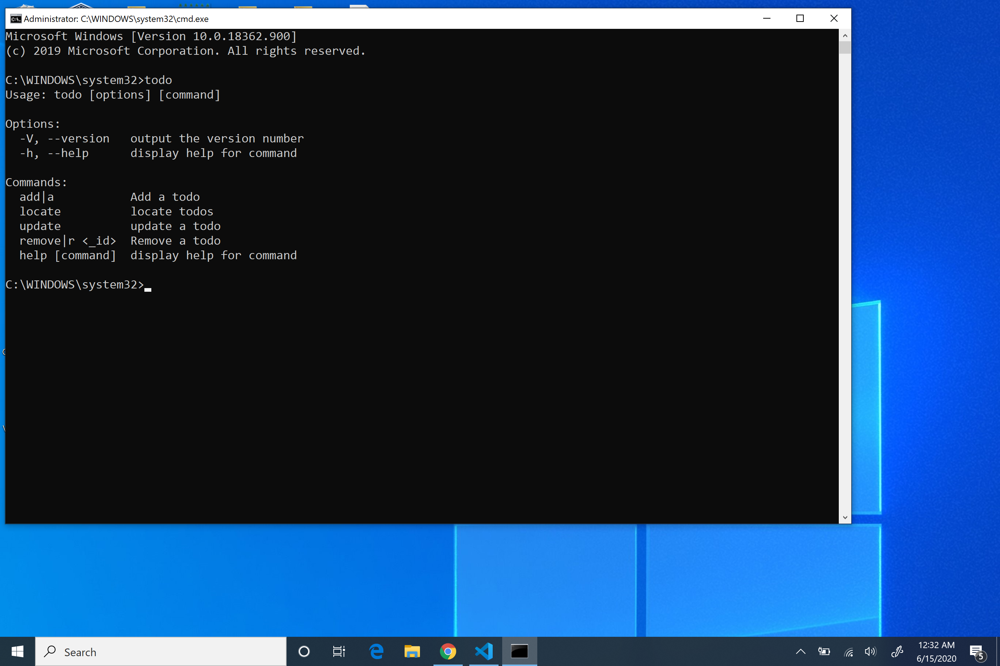

# Todo Cli Application

Some eample text.

## Table of Contents

- [Quick Start](#quick-start)

## Quick Start

- Clone the repo: git clone https://github.com/tripiod8/todo_cli.git
- Create symlink in the global folder: npm link <-- Required
- Run command: todo

## Commands

### Options

- Version: todo --version | todo -V
- Help: todo --help | todo -h

### Add 

- Add: todo add | todo -a

### Locate

| Syntax | Alias | Arg |
| ----------- | ----------- | ----------- |
| all | z |
| tag | t | keyword |
| date | d | mm-dd-yyyy |
| upcoming | u | mm-dd-yyyy |
| incomplete | i |

